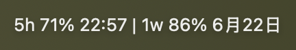
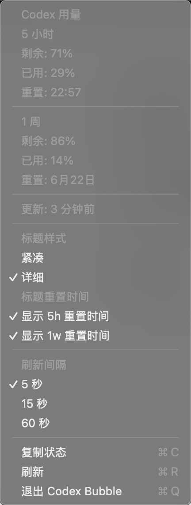

# Codex Taskbar

Codex Taskbar is a small native macOS menu bar app for showing local Codex usage limits.



It reads the local Codex log database and displays the same two limit windows shown in Codex settings:

- 5-hour remaining usage and reset time
- 1-week remaining usage

The app does not send data over the network. It only reads the local Codex SQLite log database.

## Features

- Native macOS menu bar app
- No SwiftBar dependency
- 5-second, 15-second, or 60-second refresh interval
- Compact or detailed menu bar title
- Optional 5-hour reset time in the title
- Optional 1-week reset time in the title
- Launch at login toggle
- One-click status copy
- Graceful empty/error states

## Screenshot



The menu bar title can show both windows and either reset time:

```text
5h 71% 22:57 | 1w 86% 6月22日
```

You can also hide either reset time from the menu title if you prefer a shorter display.

## Build

```bash
./scripts/build-app.sh
```

The app bundle will be created at:

```text
build/Codex Taskbar.app
```

## Package

```bash
./scripts/package-dmg.sh
```

The distributable disk image will be created at:

```text
dist/Codex-Taskbar.dmg
```

## Run

```bash
open "build/Codex Taskbar.app"
```

If no usage appears yet, open Codex and run `/status` or send one Codex message so the local rate-limit event is refreshed.

## Data Source

Codex Taskbar looks for:

```text
~/.codex/sqlite/logs_2.sqlite
~/.codex/logs_2.sqlite
```

It reads the newest `codex.rate_limits` websocket event and extracts `primary` and `secondary` rate-limit windows.

## Notes

This is an unofficial local utility. The Codex local log format may change in future Codex releases.

## Login Item

Use the `开机启动` menu item to add or remove Codex Taskbar from macOS Login Items. On recent macOS versions, the first registration may require approval in System Settings.
